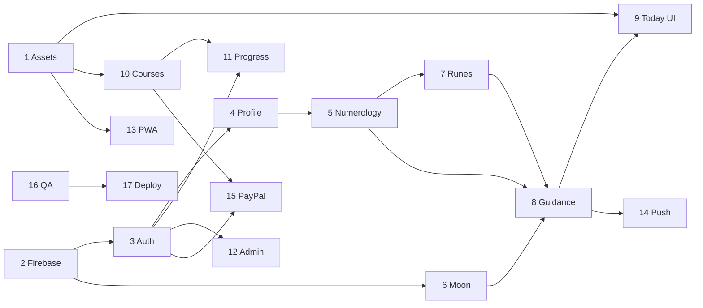

# Mystic Web Build Roadmap

Implementation sequence for migrating Mystic from Flutter (`C:\Users\1\development\mystic_app`) to Next.js (`C:\Users\1\development\vedunya-web`).

Each stage is **documentation-only in the audit phase** — implement in order.

---

## Stage 1 — Asset migration

**Objective:** Copy production-relevant media into vedunya-web without altering Flutter sources.

**Flutter reference:**

- `assets/runes/svg/*.svg`
- `assets/moon/svg_moon/*.png`
- `assets/Course Visuals/**`
- `assets/logo/**`, `assets/background/background-jpg.jpg`
- `lib/constants/rune_asset_map.dart`, `moon_asset_map.dart`

**Expected web files:**

- `public/runes/svg/{canonical}.svg`
- `public/moon/{phase8Id}.png`
- `public/courses/{slug}/cover.*`
- `public/brand/*`
- Update `public/manifest.webmanifest` icon entries

**Dependencies:** None

**Acceptance criteria:**

- All 24 canonical rune SVGs reachable at stable URLs
- Moon 8-phase PNG set mapped identically to Flutter
- PWA manifest references real PNG icons (192, 512)
- Asset manifest in docs matches deployed paths

**Risks:** Legacy alias filenames in old `assets/runes/` root; duplicate makosh PNGs

---

## Stage 2 — Firebase Web connection

**Objective:** Connect read-only Firestore reads for content collections; no auth yet.

**Flutter reference:**

- `lib/content/firestore_content_collections.dart`
- `lib/services/rune_content_service.dart`
- `lib/services/daily_guidance/lunar_day_content_service.dart`
- `lib/services/daily_guidance/moon_phase_service.dart`
- `firestore.rules`

**Expected web files:**

- `src/lib/firebase/client.ts` (extend with Firestore)
- `src/lib/firebase/content/*.ts` read helpers
- `.env.local` with public Firebase config

**Dependencies:** Stage 1 optional for UI; Firebase project credentials

**Acceptance criteria:**

- Read `runes/raido`, `lunar_days/1`, `moon_phases/waning` from browser
- Rules enforced (signed-out reads allowed where rules permit)
- No writes from web client except future auth stages

**Risks:** `app_settings` blocked by catch-all rules; plan Admin SDK for remote flags

---

## Stage 3 — Authentication

**Objective:** Firebase Web Auth matching Flutter providers and bootstrap sequence.

**Flutter reference:**

- `lib/services/auth_service.dart`
- `lib/features/auth/application/auth_orchestrator.dart`
- `lib/features/auth/application/user_bootstrap_service.dart`
- `lib/screens/auth_gate.dart`

**Expected web files:**

- `src/lib/firebase/auth.ts`
- `src/app/[locale]/login/page.tsx` (real form)
- `src/app/[locale]/register/page.tsx` or combined auth flow
- Post-auth bootstrap service mirroring merge-only writes

**Dependencies:** Stage 2

**Acceptance criteria:**

- Email/password sign-up and sign-in
- Google sign-in on web (Flutter disables Google on web — **web adds capability**)
- Apple sign-in where supported
- `users/{uid}` + `user_private/{uid}` created merge-safe
- Sign-out clears local premium cache equivalent
- Password reset email (gap in Flutter — **add on web**)

**Risks:** Apple/Google popup policies; no anonymous auth in Flutter contract

---

## Stage 4 — Profile and onboarding

**Objective:** Reproduce DOB gate, locale persistence, profileComplete flow.

**Flutter reference:**

- `lib/features/onboarding/onboarding_flow.dart`
- `lib/services/user_profile_service.dart`
- `lib/services/user_profile_snapshot_service.dart`
- `lib/lib/validation/onboarding-schema.ts` (web already has Zod foundation)

**Expected web files:**

- `src/app/[locale]/onboarding/**` multi-step flow
- `src/lib/profile/user-profile-service.ts`
- Local storage mirror for pre-auth onboarding prefs

**Dependencies:** Stage 3

**Acceptance criteria:**

- Onboarding: name → DOB → preview → account matches Flutter order
- `profileComplete` + `user_private.dob` written on completion
- App blocked until profile complete (AuthGate parity)
- Locale saved to `users.language` and local storage
- Missing DOB shows correct fallback (parity tests)

**Risks:** DOB timezone when writing Timestamp; use date-only semantics

---

## Stage 5 — Numerology engine

**Objective:** Port **Sujok** personal-day engine for Today; classical optional for profile.

**Flutter reference:**

- `lib/services/daily_guidance/personal_day_numerology_service.dart`
- `lib/data/daily_guidance/personal_day_guidance_dataset.dart`
- `lib/core/utils/numerology_service.dart` (classical)
- `lib/core/utils/card_cluster_utils.dart`

**Expected web files:**

- `src/lib/numerology/sujok.ts`
- `src/lib/numerology/classical.ts`
- `src/lib/numerology/dataset.ts` (port EN/RU copy)
- Unit tests from `parity-test-cases.md`

**Dependencies:** Stage 4 (DOB input)

**Acceptance criteria:**

- All 12 Sujok fixtures pass
- Classical fixtures pass for profile API
- Master number case (PY=22) handled in classical only
- No accidental use of classical formula on Today route

**Risks:** **Highest parity risk** — dual formula confusion

---

## Stage 6 — Moon engine

**Objective:** Port synodic moon calculation and Firestore copy merge.

**Flutter reference:**

- `lib/services/daily_guidance/moon_engine_service.dart`
- `lib/services/daily_guidance/moon_context_service.dart`
- `lib/services/daily_guidance/moon_input_builder_service.dart`
- `lib/data/daily_guidance/moon_phase_fallback_data.dart`

**Expected web files:**

- `src/lib/moon/engine.ts`
- `src/lib/moon/context.ts`
- `src/lib/moon/climate.ts`
- Firestore readers for `moon_phases`, `lunar_days`

**Dependencies:** Stage 2, Stage 5 optional

**Acceptance criteria:**

- Phase8/phase4 IDs match Flutter for fixed instants
- Lunar day 1–30 computation matches
- Fallback map used when Firestore miss
- Document UTC vs local boundary behavior

**Risks:** TZ not applied in Flutter math — do not over-engineer location until product requires it

---

## Stage 7 — Rune engine

**Objective:** Deterministic daily rune selection + alias normalization.

**Flutter reference:**

- `lib/services/daily_guidance/rune_daily_service.dart`
- `lib/core/runes/runes_collection.dart`
- `lib/constants/rune_asset_map.dart`
- `lib/core/runes/*.dart` (message/action strings)

**Expected web files:**

- `src/lib/runes/selection.ts`
- `src/lib/runes/normalize.ts`
- `src/lib/runes/content/local/*.ts` (port modular messages)
- `src/lib/runes/content/firestore.ts`

**Dependencies:** Stage 5 (personal day), Stage 1 (SVG assets)

**Acceptance criteria:**

- All 12 rune selection fixtures pass
- `raidho` → `raido` normalization
- `getRuneOfDay` message index uses `forDate.day % length`

**Risks:** Cloud Functions use `raidho` — web must use `raido` for Firestore

---

## Stage 8 — Daily guidance aggregation

**Objective:** Port `DailyGuidanceComposer` pipeline end-to-end.

**Flutter reference:**

- `lib/services/daily_guidance/daily_guidance_loader.dart`
- `lib/services/daily_guidance/daily_guidance_composer.dart`
- `lib/services/editorial/premium_daily_state_registry.dart`
- `lib/services/editorial/daily_guidance_premium_remote_merger.dart`

**Expected web files:**

- `src/lib/guidance/loader.ts`
- `src/lib/guidance/composer.ts`
- `src/lib/guidance/editorial-state-mapper.ts`
- `src/types/daily-guidance.ts` (extend)

**Dependencies:** Stages 5, 6, 7, 4

**Acceptance criteria:**

- Loader gates: incomplete profile, missing DOB
- Composed `DailyGuidanceData` shape matches contract
- Editorial remote merge when `daily_editorial_states` published
- Oracle card mirror enrichment

**Risks:** Many Firestore reads per load — consider server-side aggregation later, not in V1 port

---

## Stage 9 — Today UI parity

**Objective:** Replace mock Today page with live guidance UI matching Oracle screen.

**Flutter reference:**

- `lib/features/main/oracle_screen.dart`
- `lib/features/daily_guidance/daily_guidance_panel.dart`
- Premium gates in panel

**Expected web files:**

- `src/app/[locale]/today/page.tsx`
- `src/components/today/*` (extend existing foundation)
- Premium lock components + paywall navigation stub

**Dependencies:** Stage 8, Stage 1

**Acceptance criteria:**

- Mobile-first layout 375–430px
- Sections: headline, rune, moon, numerology, action
- Free vs premium rendering matches Flutter gates
- Refresh reloads guidance

**Risks:** Premium paywall not wired until Stage 15 — use disabled/locked state

---

## Stage 10 — Courses

**Objective:** Port library catalog and lesson reader for three V1 courses.

**Flutter reference:**

- `lib/features/main/library_screen.dart`
- `lib/data/course/living_the_runes_course_content.dart` (28 lessons)
- `lib/data/course/lunar_path_30_days_course_content.dart`
- `lib/data/course/runes_first_steps_course_content.dart`
- `lib/services/sanity_service.dart`
- `lib/services/course_content_resolver.dart`

**Expected web files:**

- `src/app/[locale]/courses/page.tsx` (replace placeholder)
- `src/lib/courses/catalog.ts`
- `src/lib/courses/content/local/*.ts`
- `src/lib/courses/sanity.ts` optional secondary
- Lesson reader routes

**Dependencies:** Stage 1, Stage 2 optional Sanity

**Acceptance criteria:**

- Slugs: `runes-first-steps`, `living-the-runes`, `lunar-path-30-days`
- 28 lessons for `runes_24_inner_strength` with correct IDs
- Rune blocks render SVG from `/public/runes/svg/`
- Sanity fetch failure falls back to local catalog

**Risks:** Lesson ID mismatch CMS vs local; content port is large

---

## Stage 11 — Course progress

**Objective:** Firestore + local progress/resume matching Flutter.

**Flutter reference:**

- `lib/services/course_progress_service.dart`
- `lib/services/course_local_progress_service.dart`
- `lib/features/library/runes_first_steps_lesson_screen.dart`

**Expected web files:**

- `src/lib/courses/progress.ts`
- Hook progress on lesson completion events

**Dependencies:** Stage 10, Stage 3

**Acceptance criteria:**

- `users/{uid}/courseProgress/{courseId}` read/write
- Resume opens last incomplete lesson
- Completion at 100% when all lesson IDs done

**Risks:** Dual local/Firestore progress — define single source of truth on web

---

## Stage 12 — Admin panel

**Objective:** Secure web admin for content ops — not UI-only gating.

**Flutter reference:**

- `lib/features/admin/presentation/admin_control_hub_screen.dart`
- `lib/features/admin/application/admin_access_service.dart`
- `firestore.rules` moderation helpers

**Expected web files:**

- `src/app/[locale]/admin/**` routes
- Server routes or Cloud Functions with custom claims verification
- Read-only Sanity/Firestore admin views first

**Dependencies:** Stage 3, Stage 2

**Acceptance criteria:**

- Admin routes return 403 without verified claims
- No reliance on hidden UI alone
- Member moderation writes audit to `moderation_actions`

**Risks:** Current Flutter hub is UI-gated; Firestore rules must align

---

## Stage 13 — PWA installation

**Objective:** Installable web app with production icons and metadata.

**Flutter reference:** N/A (native install)

**Expected web files:**

- `public/manifest.webmanifest` (final)
- `src/lib/pwa/install.ts` (extend helpers only)
- Apple meta tags in layout

**Dependencies:** Stage 1

**Acceptance criteria:**

- Lighthouse PWA installable checks pass
- Standalone display on mobile
- Safe-area insets preserved in app shell

**Risks:** iOS install instructions differ — use `isLikelyIOSPlatform` helper

---

## Stage 14 — Web Push notifications

**Objective:** Replace flutter_local_notifications with web push + Firestore copy.

**Flutter reference:**

- `lib/services/notification_service.dart`
- `lib/services/notification_copy_service.dart`
- `lib/services/notifications/notification_copy_resolver.dart`

**Expected web files:**

- Service worker (when implemented — not in foundation)
- FCM web push registration
- Server scheduler or Cloud Functions for midday/mirror

**Dependencies:** Stage 3, Stage 8 (state IDs), Stage 15 for premium slots

**Acceptance criteria:**

- Morning/evening schedules respect user prefs in Firestore
- Copy loaded from `notification_copy/{stateId}`
- Midday/mirror premium-gated
- Tap navigation defined (improvement over Flutter no-op)

**Risks:** Web push permission friction; no existing Flutter deep-link contract

---

## Stage 15 — PayPal entitlements

**Objective:** Replace RevenueCat with PayPal subscriptions + one-time course purchases.

**Flutter reference:**

- `lib/services/premium_service.dart`
- `lib/config/revenuecat_config.dart`
- `lib/core/access/library_course_access.dart`
- `lib/core/access/user_access_resolver.ts`

**Expected web files:**

- PayPal SDK integration
- Server webhook handler writing entitlements
- `src/lib/entitlements/resolver.ts` compatible with `isPremium`, product ownership

**Dependencies:** Stage 3, Stage 10

**Acceptance criteria:**

- Subscription grants premium features (not paid courses)
- `course_runes_24_inner_strength` purchase unlocks course only
- Restore/history flow exists
- **`premiumOverride` / `isOwner` still respected**

**Risks:** No server verification today — must not repeat client-only trust

---

## Stage 16 — Security and QA

**Objective:** Parity test suite, rules review, penetration basics.

**Flutter reference:**

- `firestore.rules`
- `docs/migration/parity-test-cases.md`

**Expected web files:**

- `tests/numerology.test.ts`, `tests/runes.test.ts`, etc.
- E2E smoke for auth + Today + course open

**Dependencies:** All prior stages

**Acceptance criteria:**

- All parity fixtures automated
- Firestore rules tested for web client paths
- No secrets in client bundle
- Admin and PayPal endpoints require server auth

**Risks:** Rules gaps for `app_settings` must be resolved before relying on remote flags

---

## Stage 17 — Vercel deployment

**Objective:** Production deploy to `app.vedunya.com`.

**Flutter reference:** N/A

**Expected web files:**

- Vercel project config
- Environment variables in Vercel dashboard
- Custom domain DNS

**Dependencies:** Stage 16

**Acceptance criteria:**

- `npm run build` succeeds on Vercel
- `/en` and `/ru` routes live
- Firebase authorized domains include production URL
- PayPal webhooks point to production server routes

**Risks:** Edge vs Node for Firebase Admin; webhook URL stability

---

## Cross-stage dependency graph

---

## Recommended next action after audit

**Stage 2 + Stage 3 together:** Connect Firebase Web Authentication and preserve the existing Mystic `users` / `user_private` data contracts before implementing PayPal or Web Push.
